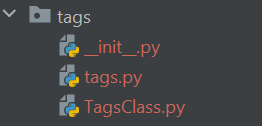

# Creating a library

python setup.py sdist bdist_wheel

This will create a dist directory in the root directory

# Installing the library

Go to the dist directory and issue the following command

pip install <whatever_name>.whl
# Using the library

open python commandline

import tags

#Following are the various ways to import a package
from tags.TagsClass import TagClass

print(TagClass("Done again").show_name())

------------------------

from tags import TagsClass

tc = TagsClass.TagClass("Done")

print(tc.show_name())

------------------------
from tags import tags

tags.show_tags()

from tags.tags import show_tags

show_tags()

